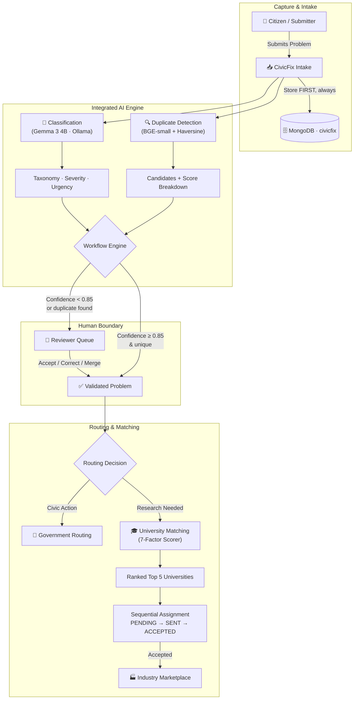

<div align="center">

# 🏛️ CivicFix

### *From Citizen Complaint to Real-World Solution — Fully Orchestrated*

[](https://www.python.org/)
[](https://fastapi.tiangolo.com/)
[](https://www.mongodb.com/)
[](https://react.dev/)
[](LICENSE)
[]()
[]()

**AI reads the problem. Humans decide the future.**

</div>

---

## 🌍 The Idea in One Sentence

A pothole report shouldn't die in a spreadsheet. CivicFix turns it into a **tracked pipeline** — classified by AI, verified by a human, matched to a university lab or a government department, and carried through to an industry partner who can actually build the fix.

```
CAPTURE ──► UNDERSTAND ──► VALIDATE ──► ROUTE ──► MATCH ──► COLLABORATE ──► IMPLEMENT ──► MEASURE
```

Most civic-tech portals stop at "ticket submitted." CivicFix is the engine that keeps going.

---

## 🧠 Why This Isn't "Just Another Complaint Portal"

| Ordinary Portal | CivicFix |
|---|---|
| Ticket sits in a queue | Ticket is **classified, scored, and routed** in seconds |
| Duplicate reports pile up | Semantic duplicate detection (BGE-small) **merges signal, not spam** |
| "Someone will get back to you" | 7-factor deterministic matching finds the **right university lab** |
| No path past government | Industry marketplace turns validated research into **deployable products** |
| AI makes the call | AI *suggests*. **A human always decides.** |

---

## 🔩 How It's Wired



> [!IMPORTANT]
> **Human-in-the-Loop, by design, not by accident.** AI never merges a duplicate, corrects a category, routes to government, or assigns a university on its own. It surfaces evidence — a human presses the button.

---

## 🧩 The Three Engines Powering CivicFix

All three now live inside **one** FastAPI service — `civicfix-engine/` — with zero inter-service HTTP hops.

<table>
<tr>
<td width="33%" valign="top">

### 🗂️ Classification
**Gemma 3 4B via Ollama**

Maps raw citizen text onto a controlled **12-domain taxonomy**, surfaces cross-cutting secondary domains, and grades its own confidence:

- `≥0.85` → auto-validated
- `0.60–0.85` → reviewer queue
- fail → safe fallback, submission never lost

</td>
<td width="33%" valign="top">

### 🧬 Duplicate Detection
**BGE-small (384-dim) + Haversine**

Weighs 5 signals — semantic similarity, domain, subcategory, secondary overlap, and location — while *excluding missing signals* from the score instead of penalizing them.

A fingerprint layer stops false positives like *"same hospital, different failure."*

</td>
<td width="33%" valign="top">

### 🎓 University Matching
**Deterministic 7-Factor Scorer**

Weighs expertise, faculty coverage, infrastructure, past projects, geography, capacity, and industry ties. Ranks the top 5, then runs a **sequential assignment chain** with automatic timeout and cascade to the next rank.

</td>
</tr>
</table>

---

## 🏷️ The Controlled Taxonomy

Twelve domains, no drift, no hallucinated categories:

`Education` · `Healthcare` · `Agriculture` · `Water Resources` · `Sanitation` · `Environment` · `Energy` · `Urban Infrastructure` · `Accessibility` · `Public Administration` · `Rural Livelihoods` · `Other`

Each with its own subcategory set enforced at the Pydantic layer — see [`app/core/taxonomy.py`](file:///d:/CivicFix/civicfix-engine/app/core/taxonomy.py).

---

## ⚖️ Duplicate Scoring at a Glance

| Signal | Weight | Notes |
|---|---|---|
| Semantic Similarity | **50%** | Always available (cosine, 384-dim embeddings) |
| Primary Domain Match | **15%** | Excluded from denominator if unknown |
| Subcategory Match | **15%** | Same |
| Secondary Domain Overlap | **10%** | Jaccard index |
| Location Proximity | **10%** | Haversine vs. 5.0 km threshold |

`STRONG_CANDIDATE ≥ 0.85` · `DUPLICATE ≥ 0.75` · `SEMANTIC_STRONG ≥ 0.82`

---

## 🎯 University Matching Formula

$$\text{FinalScore} = \sum_{i=1}^{7} \left( \text{FactorScore}_i \times \text{Weight}_i \right) \times 100$$

| Factor | Weight |
|---|---|
| Expertise Match | 35% |
| Faculty Coverage | 20% |
| Infrastructure Match | 15% |
| Past Projects | 10% |
| Geographic Proximity | 10% |
| Current Capacity | 5% |
| Industry Ecosystem | 5% |

```
PENDING ──► SENT (Rank 1) ──► ACCEPTED (handoff, cancels ranks 2-5)
               │
               ├──► REJECTED ───► SENT (Rank 2)
               └──► TIMED_OUT (48h) ───► SENT (Rank 2)
```

---

## 🛠️ Tech Stack

| Layer | Tech |
|---|---|
| Language | Python 3.11+ |
| API | FastAPI 0.115.6 · Uvicorn 0.34.0 |
| Validation | Pydantic 2.10.4 |
| LLM | Ollama · `gemma3:4b` |
| Embeddings | `BAAI/bge-small-en-v1.5` (384-dim) |
| ML | Scikit-learn · NumPy |
| Database | MongoDB (PyMongo) · mongomock for tests |
| QA Console | React 19 · Vite 8 · TypeScript · Tailwind v4 |

---

## 🚀 Quickstart

```powershell
# 1. Clone & enter the engine
cd CivicFix/civicfix-engine

# 2. Virtual environment
python -m venv .venv
.\.venv\Scripts\Activate.ps1

# 3. Install
pip install -r requirements.txt

# 4. Configure
copy .env.example .env

# 5. Pull the model (separate terminal)
ollama pull gemma3:4b

# 6. Run
uvicorn app.main:app --reload --host 0.0.0.0 --port 8000
```

Then open:
- 📘 Swagger → `http://localhost:8000/docs`
- 📗 ReDoc → `http://localhost:8000/redoc`
- 💓 Health → `http://localhost:8000/health`

**Spin up the QA console:**

```powershell
cd CivicFix/testing-console
npm install
npm run dev   # → http://localhost:5173
```

---

## 📡 API Surface (Selected)

| Area | Endpoint |
|---|---|
| Classify | `POST /api/v1/classify` |
| Duplicate Check | `POST /api/v1/duplicate-detection/check` |
| Run Matching | `POST /api/v1/matching/{problem_id}` |
| Top Matches | `GET /api/v1/universities/matches/{problem_id}` |
| Accept Assignment | `POST /api/v1/assignments/{assignment_id}/accept` |
| Marketplace Search | `GET /api/v1/marketplace/solutions` |
| Express Interest | `POST /api/v1/marketplace/{solution_id}/interest` |

Full endpoint list lives in `civicfix-engine/app/api/v1/`.

---

## ✅ Test Coverage

```powershell
cd civicfix-engine
python -m pytest tests -v
```

| Suite | Count | Status |
|---|---|---|
| Unified Engine Tests | 76 | ✅ |
| Baseline Feature Folders (preserved) | 163 | ✅ |
| **Grand Total** | **239** | ✅ **PASSING** |

No live MongoDB or Ollama needed — everything runs on `mongomock`.

---

## 🧭 Human-in-the-Loop Boundaries

**AI does:** classify, score confidence, flag duplicates, compute proximity, rank universities.

**Humans do:** correct categories, merge duplicates, accept/reject assignments, approve collaborations.

Every one of those human actions is **append-only logged** for auditability.

---

## 🗺️ Roadmap

- [x] AI Classification Engine
- [x] Duplicate Detection Engine
- [x] Human Reviewer Queue
- [x] Government / Research Routing
- [x] 7-Factor University Matching
- [x] Sequential Assignment Workflow
- [x] Industry Marketplace & Collaboration
- [ ] Project Lifecycle & Milestone Verification UI
- [ ] Automated Public Notification Dispatch
- [ ] Role-Based Production Frontend

---

## 🩹 Troubleshooting Cheatsheet

| Symptom | Fix |
|---|---|
| `ServerSelectionTimeoutError` | Start MongoDB locally, or check Atlas IP allowlist + `MONGO_URI` |
| `AI_PROVIDER_UNAVAILABLE` | `ollama serve` + `ollama pull gemma3:4b` |
| Port 8000 in use | `uvicorn app.main:app --reload --port 8005` |
| Empty `topUniversities` | Seed `ACTIVE` universities via `POST /api/v1/universities` |

---

## 🤝 Contributing

1. Branch off `main` → `feature/your-feature-name`
2. Follow conventional commits → `feat(engine): ...`, `fix(matching): ...`
3. `python -m pytest tests -v` must pass before opening a PR

---

## 📄 License

MIT — see [LICENSE](LICENSE).

<div align="center">

---

*Built for the belief that a citizen's problem deserves more than a ticket number.*

</div>
