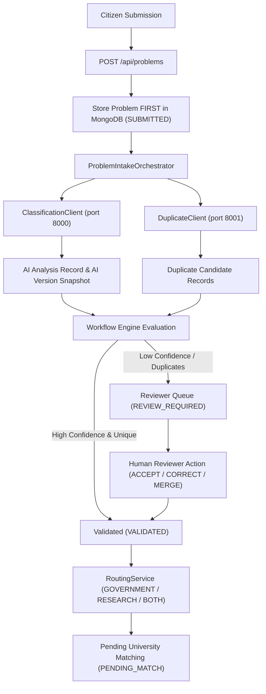

# CivicFix Main Backend Orchestrator & Workflow Engine

> **Societal Innovation Collaboration Portal | Software Requirements Specification | SRS v0.1**

---

## 1. Overview & Architecture

The **CivicFix Main Backend** (`backend/`) acts as the central **Modular Monolith** orchestrator. It owns canonical operational data, problem versions, human reviewer queues, audit trails, and sector routing while integrating two standalone AI microservices:
1. **Classification Engine (`classification-engine/`)**: FastAPI + Ollama + Gemma 3 4B (port 8000)
2. **Duplicate Detection Engine (`duplicate-detection/`)**: FastAPI + Sentence Transformers + BGE-small (port 8001)

### SRS Principles Compliance
- **Database Ownership:** Main backend owns MongoDB collections for problems, versions, reviews, duplicate candidates, audit events, and routing state.
- **Human-in-the-Loop Boundary:** AI microservices assist by surfacing structured classifications and duplicate candidates with explainable signals. **AI NEVER automatically merges or alters records.**
- **Resilient AI Failure Handling:** Citizen problem submissions are stored in MongoDB **FIRST** before invoking AI microservices. Service timeouts or outages flag `reviewRequired` and log audit events without losing the submission.
- **Versioning:** Reviewer corrections create new problem versions (`source="reviewer"`) preserving historical AI interpretations (`source="ai"`).
- **Non-Destructive Merging:** `MERGE_DUPLICATE` links the submission to a master problem while preserving the original record intact.

---

## 2. Target Architecture Flow



---

## 3. Endpoints Reference

### Citizen APIs
- `POST /api/problems`: Submit new problem.
- `GET /api/problems/{id}`: Retrieve problem details.
- `GET /api/problems/{id}/timeline`: Retrieve citizen status timeline.

### Reviewer APIs (RBAC Protected)
- `GET /api/reviewer/queue`: Retrieve pending problems.
- `POST /api/reviewer/{id}/action`: Execute reviewer action (`ACCEPT`, `CORRECT`, `REQUEST_CLARIFICATION`, `MERGE_DUPLICATE`, `REJECT_INVALID`, `REQUEST_VERIFICATION`, `REDIRECT`, `ESCALATE`).

### Routing & Audit APIs
- `POST /api/government/{id}/route`: Route problem (`GOVERNMENT`, `RESEARCH`, `BOTH`).
- `GET /api/audit/{entityId}`: Chronological append-only audit trail.
- `GET /health`: Main backend health status.
- `GET /health/dependencies`: Dependency readiness check.

---

## 4. Execution Commands

```powershell
# 1. Run all test suites (Classification, Duplicate, Integration)
python -m pytest classification-engine/tests -v
python -m pytest duplicate-detection/tests -v
$env:PYTHONPATH='backend'; python -m pytest integration-tests/test_full_pipeline.py -v

# 2. Start Main Backend Server
cd backend
uvicorn app.main:app --host 0.0.0.0 --port 8080 --reload
```
