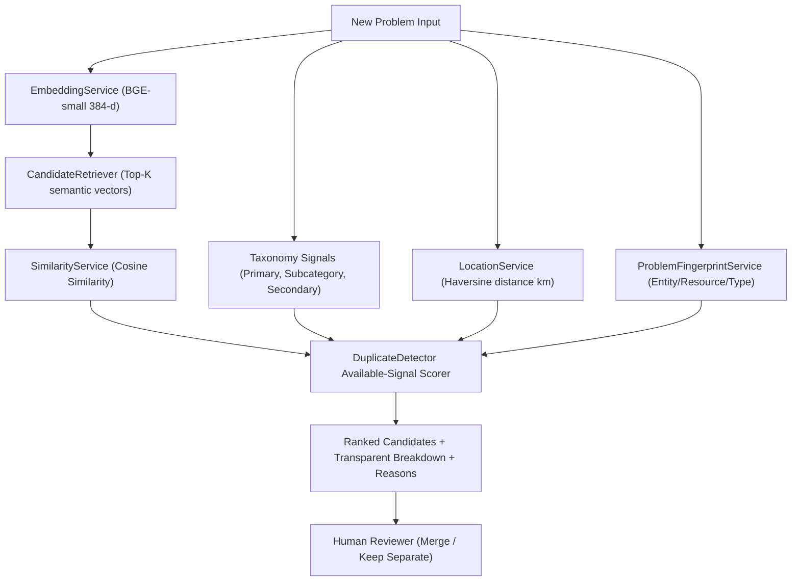

# CivicFix — Duplicate Candidate Detection + Semantic Embeddings Module (v2)

> **Societal Innovation Collaboration Portal | Software Requirements Specification | SRS v0.1**

---

## 1. Overview & SRS Requirements Compliance

The **Duplicate Candidate Detection Engine** identifies, ranks, and surfaces potential duplicate societal problem reports to authorized reviewers before master problems are updated.

### SRS Requirements (Source of Truth)
- **AI-Assisted Representations:** Generate semantic embeddings (`BAAI/bge-small-en-v1.5`, 384-dimensional normalized vectors) for duplicate detection and candidate matching.
- **Candidate Recommendations:** Surface ranked duplicate candidates with explainable supporting evidence/signals.
- **Configurable Thresholds:** Support configurable similarity thresholds (`DUPLICATE_SIMILARITY_THRESHOLD`, `STRONG_CANDIDATE_THRESHOLD`).
- **Human-in-the-Loop Decision Boundary:**  
  > **AI assists decisions. Authorized humans own consequential decisions.**  
  **The AI engine MUST NOT automatically merge, delete, or replace problem records.**  
  The merge action belongs strictly to human reviewers in the workflow layer.

---

## 2. Key Enhancements in Version 2 (Scoring & Metadata Fix)

### Problem Addressed: UNKNOWN vs MISMATCH
Previously, missing optional taxonomy metadata (`primaryDomain`, `subcategory`, `secondaryDomains`) was treated as a negative match (0.0 contribution out of 1.0 total denominator). This artificially suppressed the composite score of strong semantic duplicates (e.g., Hospital medicine shortage down to ~53.3%), placing them below threshold (`no_candidate`).

### Version 2 Implementation Choices:
1. **Explicit Signal States:**
   - Taxonomy: `MATCH`, `MISMATCH`, or `UNKNOWN` (when metadata is not supplied).
   - Location: `AVAILABLE` or `UNAVAILABLE` (when coordinates are missing).
2. **Available-Signal Normalized Scoring:**
   $$\text{NormalizedCompositeScore} = \frac{\sum_{\text{available}} \text{contribution}_i}{\sum_{\text{available}} w_i}$$
   Unavailable/missing signals are excluded from the denominator rather than penalizing the score.
3. **High-Semantic + Location Candidate Rule:**
   Surfaces candidates with very high semantic similarity and close location even if taxonomy metadata is missing.
4. **Contradiction Protection (Problem Fingerprint):**
   Deterministic entity/resource/issue extraction prevents false matches between different issues at the same location (e.g. medicine shortage vs electricity outage at the same hospital).

---

## 3. Distinction: SRS Requirements vs. Implementation Decisions

| Concept | Classification | Justification / Description |
| :--- | :--- | :--- |
| **Duplicate Candidate Detection** | **SRS Requirement** | Mandated in SRS MVP & functional testing. |
| **Configurable Similarity Threshold** | **SRS Requirement** | Mandated in SRS configuration specification. |
| **Human Reviewer Merge Control** | **SRS Requirement** | Consequential decisions must remain under human control. |
| **Original Record Preservation** | **SRS Requirement** | Merge associates submission with master while preserving original record. |
| **BAAI/bge-small-en-v1.5 Model** | **Implementation Decision** | Selected for local efficiency (384 dimensions, L2 normalized). |
| **Available-Signal Normalization** | **Implementation Decision** | Prevents missing metadata from suppressing duplicate candidate scores. |
| **Problem Fingerprint Service** | **Implementation Decision** | Deterministic entity & issue extraction for contradiction protection. |
| **Cosine Similarity** | **Implementation Decision** | Mathematical vector distance measure. |
| **Haversine Distance Formula** | **Implementation Decision** | Surface distance formula for lat/long coordinates. |
| **Multi-Factor Base Scoring Weights** | **Implementation Decision** | Base weights (Semantic 0.50, Primary 0.15, Subcategory 0.15, Secondary 0.10, Location 0.10). |

---

## 4. Architecture Flow



---

## 5. Multi-Factor Scoring & Signal State Rules

The composite score is calculated using available signal weights:

- **Semantic Similarity ($S_{\text{sem}}$):** Always `AVAILABLE`, weight = 0.50.
- **Primary Domain ($M_{\text{prim}}$):**
  - `MATCH` (1.0 contribution, weight 0.15 used)
  - `MISMATCH` (0.0 contribution, weight 0.15 used)
  - `UNKNOWN` (Excluded from denominator when missing)
- **Subcategory ($M_{\text{sub}}$):**
  - `MATCH` (1.0 contribution, weight 0.15 used)
  - `MISMATCH` (0.0 contribution, weight 0.15 used)
  - `UNKNOWN` (Excluded from denominator when missing)
- **Secondary Domains ($J_{\text{sec}}$):**
  - `MATCH` / `MISMATCH` (Jaccard overlap, weight 0.10 used if both present)
  - `UNKNOWN` (Excluded from denominator if either list missing)
- **Location ($S_{\text{loc}}$):**
  - `AVAILABLE` (Score = $\max(0, 1 - \text{distance}/5.0)$, weight 0.10 used)
  - `UNAVAILABLE` (Excluded from denominator when coordinates missing)

---

## 6. Execution & Test Commands

### Run All Unit, Regression, & Integration Tests
```powershell
python -m pytest duplicate-detection/tests -v
```

### Run 52-Case Metric Matrix Evaluation
```powershell
python -m pytest duplicate-detection/tests/test_duplicate_metrics.py -s
```

### Start FastAPI Engine Server
```powershell
uvicorn app.main:app --host 0.0.0.0 --port 8001 --reload
```

---

## 7. API Response Transparency & Schema

The API exposes complete score breakdowns and signal states under `signalStates`, `scoreBreakdown`, `availableWeight`, and `reasons`.

```json
{
  "problemId": "P-CANDIDATE-602",
  "status": "candidate_found",
  "duplicateCandidates": [
    {
      "candidateProblemId": "P-MASTER-601",
      "duplicateScore": 0.8883,
      "semanticSimilarity": 0.866,
      "primaryDomainMatch": false,
      "subcategoryMatch": false,
      "secondaryDomainOverlap": 0.0,
      "locationDistanceKm": 0.0,
      "locationScore": 1.0,
      "candidateStatus": "strong_candidate",
      "signalStates": {
        "primaryDomain": "UNKNOWN",
        "subcategory": "UNKNOWN",
        "secondaryDomains": "UNKNOWN",
        "location": "AVAILABLE",
        "fingerprint": "AVAILABLE"
      },
      "scoreBreakdown": {
        "semantic": {"rawValue": 0.866, "state": "AVAILABLE", "weight": 0.5, "contribution": 0.433, "used": true},
        "primaryDomain": {"rawValue": null, "state": "UNKNOWN", "weight": 0.15, "contribution": null, "used": false},
        "subcategory": {"rawValue": null, "state": "UNKNOWN", "weight": 0.15, "contribution": null, "used": false},
        "secondaryDomains": {"rawValue": null, "state": "UNKNOWN", "weight": 0.1, "contribution": null, "used": false},
        "location": {"rawValue": 1.0, "state": "AVAILABLE", "weight": 0.1, "contribution": 0.1, "used": true}
      },
      "availableWeight": 0.6,
      "normalizedCompositeScore": 0.8883,
      "reasons": [
        "High semantic similarity (0.866)",
        "Geographically very close (0.00 km)",
        "Surfaced via strong semantic similarity and close location despite missing taxonomy",
        "Primary domain not provided",
        "Subcategory not provided"
      ]
    }
  ],
  "scoringVersion": "duplicate-v2"
}
```
