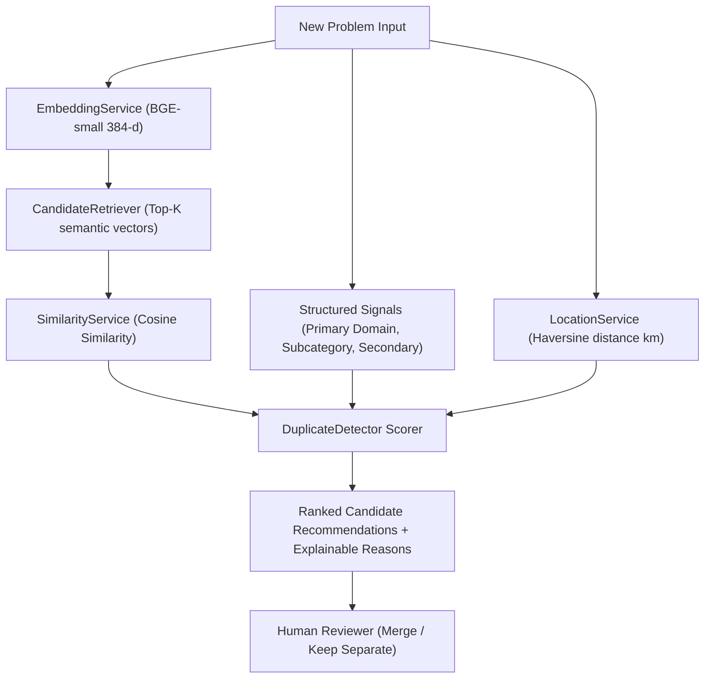

# CivicFix — Duplicate Candidate Detection + Semantic Embeddings Module

> **Societal Innovation Collaboration Portal | Software Requirements Specification | SRS v0.1**

---

## 1. Overview & SRS Requirements Compliance

The **Duplicate Candidate Detection Engine** identifies, ranks, and surfaces potential duplicate societal problem reports to authorized reviewers before master problems are updated.

### SRS Requirements (Source of Truth)
- **AI-Assisted Representations:** Generate semantic embeddings or equivalent representations for duplicate detection and candidate matching.
- **Candidate Recommendations:** Surface ranked duplicate candidates with explainable supporting evidence/signals.
- **Configurable Thresholds:** Support configurable similarity thresholds (`DUPLICATE_SIMILARITY_THRESHOLD`).
- **Human-in-the-Loop Decision Boundary:**  
  > **AI assists decisions. Authorized humans own consequential decisions.**  
  **The AI engine MUST NOT automatically merge, delete, or replace problem records.**  
  The merge action belongs strictly to human reviewers in the workflow layer.

---

## 2. Distinction: SRS Requirements vs. Implementation Decisions

| Concept | Classification | Justification / Description |
| :--- | :--- | :--- |
| **Duplicate Candidate Detection** | **SRS Requirement** | Mandated in SRS MVP & functional testing. |
| **Configurable Similarity Threshold** | **SRS Requirement** | Mandated in SRS configuration specification. |
| **Human Reviewer Merge Control** | **SRS Requirement** | Consequential decisions must remain under human control. |
| **Original Record Preservation** | **SRS Requirement** | Merge associates submission with master while preserving original record. |
| **BAAI/bge-small-en-v1.5 Model** | **Implementation Decision** | Selected for local efficiency (384 dimensions, L2 normalized). |
| **Sentence-Transformers Library** | **Implementation Decision** | Python framework used for embedding inference. |
| **384 Embedding Dimensions** | **Implementation Decision** | Specific vector dimension of `bge-small-en-v1.5`. |
| **Cosine Similarity** | **Implementation Decision** | Mathematical vector distance measure. |
| **Haversine Distance Formula** | **Implementation Decision** | Surface distance formula for lat/long coordinates. |
| **Multi-Factor Scoring Weights** | **Implementation Decision** | Weighted composite scoring (Semantic 0.50, Taxonomy 0.40, Location 0.10). |

---

## 3. Separation of Responsibilities: Gemma 3 4B vs. BGE-Small

```
Citizen Problem Report
         │
         ▼
┌───────────────────────────┐
│ Classification Engine     │  Ollama + Gemma 3 4B
│ (Taxonomy & Understanding)│  Generates domain, subcategory, summary
└─────────────┬─────────────┘
              │
              ▼
┌───────────────────────────┐
│ Duplicate Detection Engine│  SentenceTransformers + BAAI/bge-small-en-v1.5
│ (Embeddings & Matching)   │  Computes 384-d vectors, Haversine distance, composite score
└─────────────┬─────────────┘
              │
              ▼
    Ranked Candidates + Signals
              │
              ▼
┌───────────────────────────┐
│ Human Reviewer            │  Owns final "Merge Duplicate" or "Keep Separate"
└───────────────────────────┘
```

---

## 4. Architecture Flow



---

## 5. Multi-Factor Scoring Formula

The composite duplicate score is computed as:

$$\text{DuplicateScore} = w_{\text{sem}} S_{\text{sem}} + w_{\text{prim}} M_{\text{prim}} + w_{\text{sub}} M_{\text{sub}} + w_{\text{sec}} J_{\text{sec}} + w_{\text{loc}} S_{\text{loc}}$$

Where:
- $S_{\text{sem}}$: Cosine similarity of 384-d normalized embeddings
- $M_{\text{prim}}$: Binary primary domain match (1.0 if match, 0.0 otherwise)
- $M_{\text{sub}}$: Binary subcategory match (1.0 if match, 0.0 otherwise)
- $J_{\text{sec}}$: Jaccard overlap fraction of secondary domains
- $S_{\text{loc}}$: Location proximity score (decaying linearly from 1.0 at 0 km to 0.0 at 5.0 km)

Default Configured Weights:
- `SEMANTIC_WEIGHT` = 0.50
- `PRIMARY_DOMAIN_WEIGHT` = 0.15
- `SUBCATEGORY_WEIGHT` = 0.15
- `SECONDARY_DOMAIN_WEIGHT` = 0.10
- `LOCATION_WEIGHT` = 0.10

---

## 6. Empirical Threshold Evaluation (50-Case Labeled Benchmark)

The system was evaluated against 50 synthetic, labeled CivicFix problem cases (`tests/evaluation_dataset.json`).

### Metric Matrix Across Thresholds:

| Threshold | TP | FP | TN | FN | Precision | Recall | F1 Score | FPR | FNR |
| :--- | :--- | :--- | :--- | :--- | :--- | :--- | :--- | :--- | :--- |
| 0.60 | 27 | 3 | 19 | 1 | 0.9000 | 0.9643 | 0.9310 | 0.1364 | 0.0357 |
| 0.65 | 27 | 3 | 19 | 1 | 0.9000 | 0.9643 | 0.9310 | 0.1364 | 0.0357 |
| **0.70** | 27 | 2 | 20 | 1 | 0.9310 | 0.9643 | 0.9474 | 0.0909 | 0.0357 |
| **0.75 (Default)** | **27** | **2** | **20** | **1** | **0.9310** | **0.9643** | **0.9474** | **0.0909** | **0.0357** |
| 0.78 | 23 | 1 | 21 | 5 | 0.9583 | 0.8214 | 0.8846 | 0.0455 | 0.1786 |
| 0.80 | 19 | 1 | 21 | 9 | 0.9500 | 0.6786 | 0.7917 | 0.0455 | 0.3214 |
| 0.85 | 13 | 0 | 22 | 15 | 1.0000 | 0.4643 | 0.6341 | 0.0000 | 0.5357 |

**Selected Production Default Threshold:** `DUPLICATE_SIMILARITY_THRESHOLD = 0.75`

---

## 7. Execution Commands

### Run Embedding Experiment (Phase 1)
```powershell
python duplicate-detection/experiments/embedding_similarity_experiment.py
```

### Run Unit & Integration Test Suite
```powershell
# From duplicate-detection module directory
python -m pytest tests -v
```

### Run 50-Case Metric Matrix Evaluation
```powershell
python -m pytest tests/test_duplicate_metrics.py -s
```

### Run Regression Test Suite for Classification Engine
```powershell
python -m pytest classification-engine/tests -v
```

### Start FastAPI Application Server
```powershell
# Run from inside duplicate-detection directory
uvicorn app.main:app --host 0.0.0.0 --port 8001 --reload
```

---

## 8. API Endpoint Reference

### `POST /duplicate-check`

**Request Payload:**
```json
{
  "problem": {
    "problemId": "P2001",
    "title": "Garbage burning near school",
    "description": "Garbage is being burned near a school, producing harmful smoke.",
    "location": {"lat": 23.3441, "long": 85.3096},
    "primaryDomain": "Environment",
    "secondaryDomains": ["Public Health"],
    "subcategory": "Air Pollution"
  },
  "candidates": [
    {
      "problemId": "P1001",
      "title": "Unprocessed waste burning near school",
      "description": "Unprocessed waste is being burned close to the school and causing air pollution.",
      "location": {"lat": 23.3445, "long": 85.3098},
      "primaryDomain": "Environment",
      "secondaryDomains": ["Public Health"],
      "subcategory": "Air Pollution"
    }
  ],
  "topK": 10
}
```

**Response Payload:**
```json
{
  "problemId": "P2001",
  "status": "candidate_found",
  "duplicateCandidates": [
    {
      "candidateProblemId": "P1001",
      "duplicateScore": 0.9421,
      "semanticSimilarity": 0.8909,
      "primaryDomainMatch": true,
      "subcategoryMatch": true,
      "secondaryDomainOverlap": 1.0,
      "locationDistanceKm": 0.049,
      "locationScore": 0.9902,
      "candidateStatus": "strong_candidate",
      "reasons": [
        "High semantic similarity (0.891)",
        "Same primary domain (Environment)",
        "Same subcategory (Air Pollution)",
        "Secondary domain overlap (100%)",
        "Geographically very close (0.05 km)"
      ]
    }
  ]
}
```

---

## 9. Future Vector Database Integration

The `CandidateRetriever` service provides a clean vector abstraction (`add_candidate`, `search`). For high-scale deployments (e.g. 30,000+ problems), this local in-memory index can be replaced with:
- **MongoDB Atlas Vector Search**
- **FAISS (Facebook AI Similarity Search)**
- **Qdrant / Milvus / Pinecone**

The core duplicate scoring and human review boundary remain completely untouched when swapping the vector index implementation.
